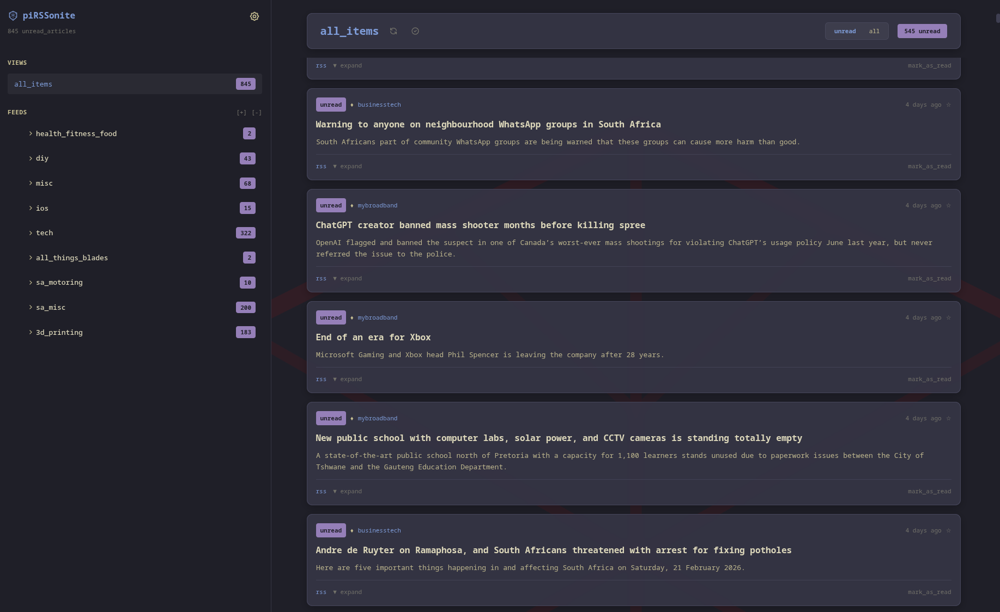
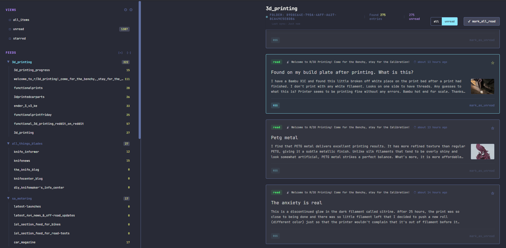

<p align="center">
  
</p>

<h1 align="center">piRSSonite</h1>

<p align="center">
  A self-hosted RSS feed reader with a glassy, dark-mode interface.
  <br />
  Built with Next.js · Prisma · SQLite · Tailwind CSS
</p>

<p align="center">
  
  
  
</p>

---



## ✨ Features

- **Feed Management** — Subscribe to RSS/Atom feeds, organise them into folders with drag-and-drop reordering
- **Read Status Tracking** — Unread counts at feed and folder level with distinct visual indicators
- **Starred Articles** — Bookmark articles for later with dedicated filtered views
- **OPML Import / Export** — Easily migrate subscriptions to and from other readers
- **WebSub Support** — Near-instant push updates from compatible feed hubs
- **Auto-refresh** — Background polling with adaptive scheduling and failure back-off
- **Advanced Theming** — 7 built-in themes (Glassy, Nord, Tokyo Night, Catppuccin Mocha/Latte, Kanagawa, Osaka Jade) with full custom theme support, typography controls, and per-element font overrides
- **Glassy Morphism UI** — Dark, immersive interface with translucent cards, backdrop blur, smooth transitions, and monospace typography
- **Docker Ready** — Multi-stage Dockerfile with automated CI/CD to GitHub Container Registry

## 🖼️ Theming



Switch between built-in themes or create your own from the Settings panel. Every colour surface, accent, and typography style is customisable.

---

## 🚀 Getting Started

### Prerequisites

| Tool | Version |
|------|---------|
| [Node.js](https://nodejs.org/) | ≥ 18 |
| npm | ≥ 9 (ships with Node) |

### Local Development

```bash
# 1. Clone the repository
git clone https://github.com/andrevdmerwe/piRSSonite.git
cd piRSSonite

# 2. Install dependencies
npm install

# 3. Set up the database
#    Create a .env file with the SQLite connection string
echo 'DATABASE_URL="file:./prisma/dev.db"' > .env

#    Push the schema to create the database
npx prisma db push

# 4. Start the dev server
npm run dev
```

The app will be available at **http://localhost:3000**.

### Environment Variables

| Variable | Description | Default |
|----------|-------------|---------|
| `DATABASE_URL` | SQLite database path (Prisma format) | `file:./prisma/dev.db` |

---

## 🐳 Docker

### Quick Start

```bash
docker run -d \
  --name pirssonite \
  -p 3000:3000 \
  -v pirssonite-data:/data \
  ghcr.io/andrevdmerwe/pirssonite:main
```

### Docker Compose

```yaml
services:
  pirssonite:
    image: ghcr.io/andrevdmerwe/pirssonite:main
    container_name: pirssonite
    ports:
      - "3000:3000"
    volumes:
      - pirssonite-data:/data
    restart: unless-stopped

volumes:
  pirssonite-data:
```

### Build Locally

```bash
docker build -t pirssonite .
docker run -d -p 3000:3000 -v pirssonite-data:/data pirssonite
```

The SQLite database is stored at `/data/main.db` inside the container and is automatically initialised on first run.

---

## 🏗️ Tech Stack

| Layer | Technology |
|-------|-----------|
| Framework | [Next.js 15](https://nextjs.org/) (standalone output) |
| UI | [React 19](https://react.dev/) + [Tailwind CSS 3](https://tailwindcss.com/) |
| Database | [SQLite](https://www.sqlite.org/) via [Prisma 6](https://www.prisma.io/) |
| Feed Parsing | [rss-parser](https://github.com/rbren/rss-parser) |
| Drag & Drop | [dnd-kit](https://dndkit.com/) |
| Sanitisation | [sanitize-html](https://github.com/apostrophecontent/sanitize-html) |
| CI/CD | GitHub Actions → GitHub Container Registry |

## 📁 Project Structure

```
piRSSonite/
├── app/                  # Next.js app router
│   ├── api/              # REST API routes
│   │   ├── entries/      #   Article CRUD & read status
│   │   ├── feeds/        #   Feed subscription management
│   │   ├── folders/      #   Folder CRUD & ordering
│   │   ├── opml/         #   OPML import / export
│   │   ├── refresh/      #   Feed refresh trigger
│   │   └── websub/       #   WebSub hub callbacks
│   ├── globals.css       # Global styles & theme variables
│   ├── layout.tsx        # Root layout
│   └── page.tsx          # Main application page
├── components/           # React components
│   ├── ArticleCard.tsx   #   Article display card
│   ├── AutoRefresher.tsx #   Background refresh timer
│   ├── EntryFeed.tsx     #   Article list / feed view
│   ├── ManageFeedsModal  #   Feed & folder management
│   ├── SettingsModal.tsx #   Settings & theming panel
│   └── Sidebar.tsx       #   Navigation sidebar
├── lib/                  # Shared utilities
│   ├── context/          #   React context providers
│   ├── themes/           #   Theme definitions & helpers
│   ├── hooks/            #   Custom React hooks
│   └── utils/            #   Utility functions
├── prisma/
│   ├── schema.prisma     # Database schema
│   └── migrations/       # Migration history
├── public/
│   └── themes/           # Built-in theme JSON files
├── Dockerfile            # Multi-stage production build
└── package.json
```

## 📜 Available Scripts

| Command | Description |
|---------|-------------|
| `npm run dev` | Start development server with hot reload |
| `npm run build` | Create production build |
| `npm run start` | Start production server |
| `npm run lint` | Run ESLint |
| `npx prisma db push` | Sync schema to database |
| `npx prisma studio` | Open Prisma's visual database editor |

---

## 🤝 Contributing

Contributions are welcome! Feel free to open issues or submit pull requests.

1. Fork the repository
2. Create a feature branch (`git checkout -b feature/amazing-feature`)
3. Commit your changes (`git commit -m 'Add amazing feature'`)
4. Push to the branch (`git push origin feature/amazing-feature`)
5. Open a Pull Request

## 📄 License

This project is open source. See the repository for licence details.
